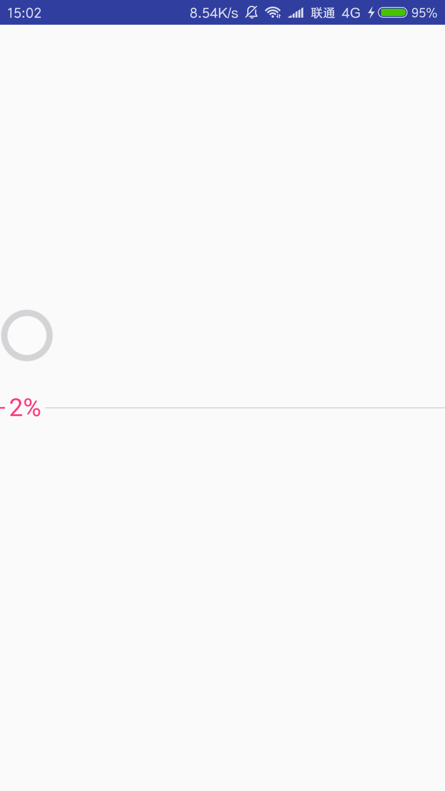
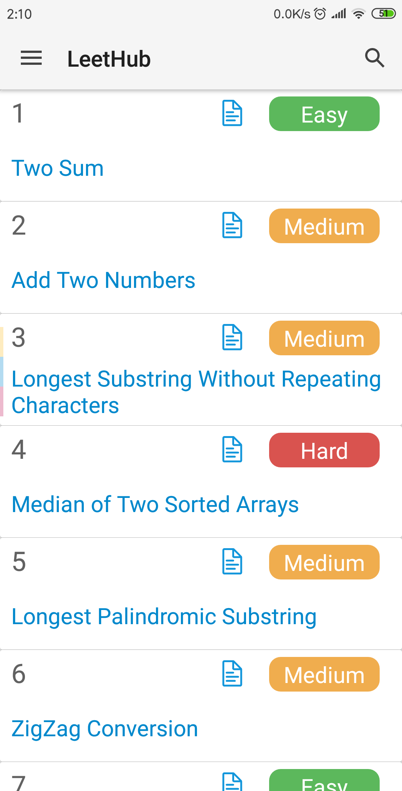
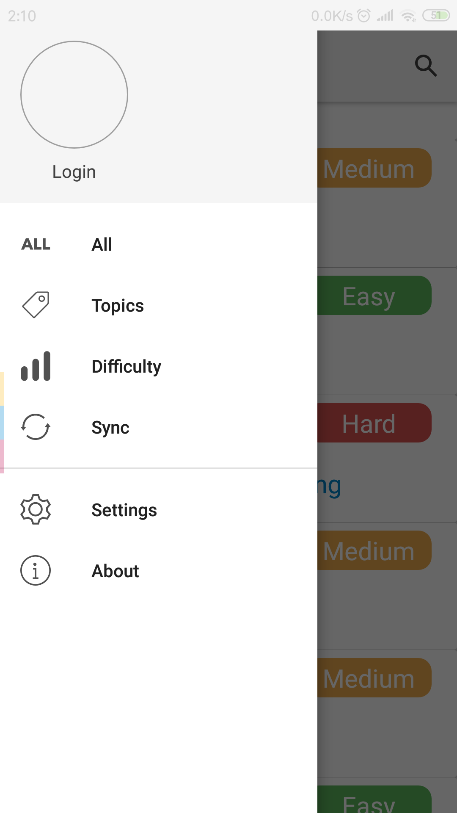
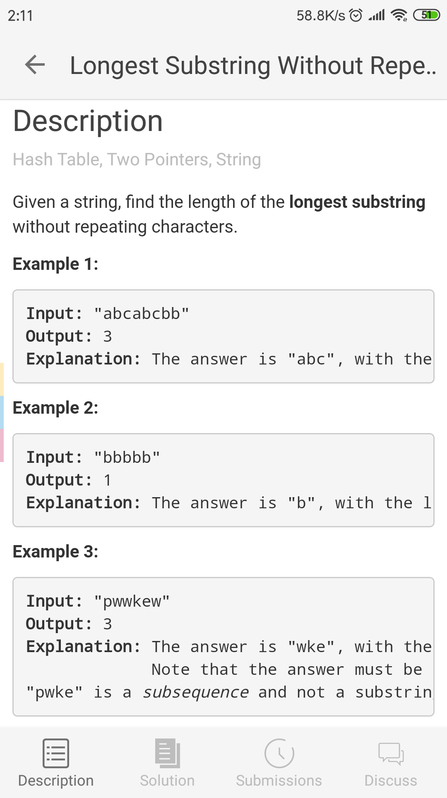
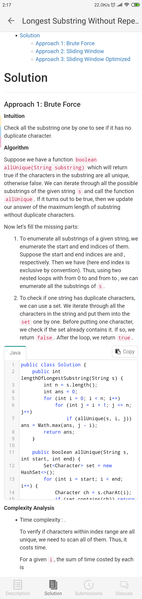

# LeetHub

## 概述
  一款LeetCode的Android客户端，支持离线查看LeetCode题目以及题解，帮助用户随时随地在Android设备查看LeetCode题目。
- 支持查看全部题目
- 支持查看题目官方题解
- 支持按难度查看题目
- 支持按分类查看题目

## 详情
下图为软件现状，正在完善中（缺乏设计感，所以界面有点不那么美观）。

应用首次启动，数据加载页

题目列表页

侧边栏菜单

题目详情页

题目解析详情页

