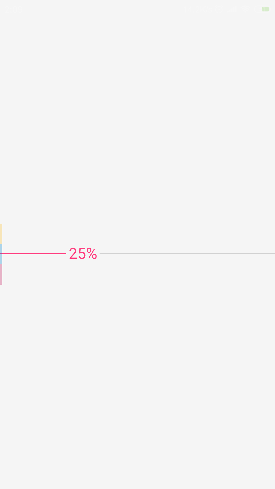

# LeetHub

## Overview
  An Android client for [LeetCode](https://leetcode.com) that supports offline viewing of LeetCode problems and solutions. Using this application, you can do these:
- view all problems
- view the official solution of the problem
- view problems by difficulty or tag
- view the discussion of problem

## Details
LeetHub is currently under development, you can try [the beta version](https://github.com/ZhaoxiZhang/LeetHub/raw/master/app/release/app-release.apk) in advance.

Application first launch, data loading page

Problem list page

Navigation menu

Problem details page

Official solution page

Discuss page

Discuss details page

